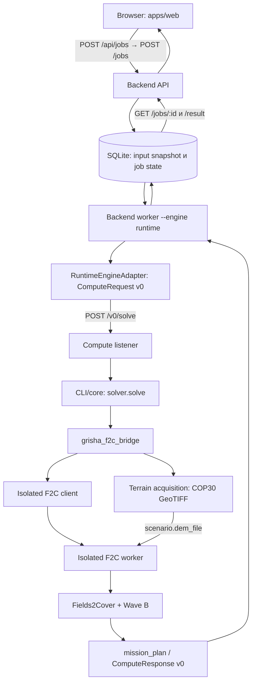
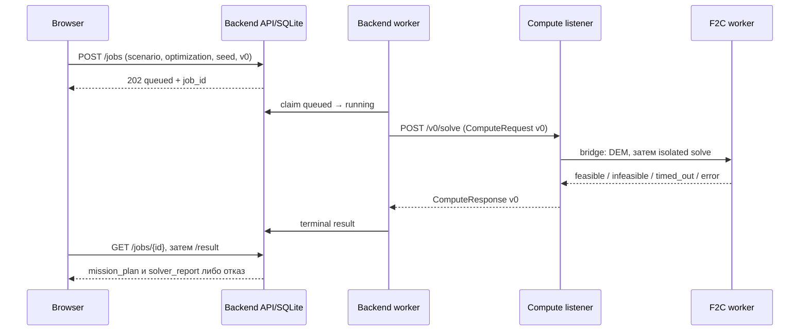

# planes — техническая документация системы

Этот документ описывает реализованный контур репозитория, а не обещанную полноту продукта. Быстрый локальный запуск — в [README](../README.md), требования заказчика и открытые вопросы — в [docs/spec](spec/README.md). Подробные решения и проверки доступны по ссылкам ниже. Контракт публичного compute-обмена — `v0`.

## 1. Назначение системы

`planes` — прототип веб-сервиса группового планирования авиационной съёмки БВС. Пользователь задаёт KML области съёмки и при необходимости ограничений, аэродромы, состав бортов и камер, GSD, перекрытия, ветер и критерий расчёта. Система возвращает состояние задания, а при допустимом решении — план миссии с маршрутами, точками, высотами, временем и отчётом солвера. План имеет эвристический характер и не является разрешением на полёт.

## 2. Сквозная архитектура

API сохраняет входной `scenario` без обогащения из каталога. Worker извлекает queued job, может отклонить ветер до runtime, затем вызывает порт `OptimizationEngine`. Адаптер доставляет версионированный запрос compute-слушателю; listener запускает отдельный CLI/ядро. Bridge проверяет спектр и обеспечивает DEM до запуска изолированного worker. Backend сохраняет terminal result, браузер опрашивает статус и показывает карту. Подробные границы — [SYSTEM_BOUNDARIES](architecture/SYSTEM_BOUNDARIES.md).

## 3. Ответственность компонентов

| Компонент | Реализация | Ответственность |
|---|---|---|
| Web | [`apps/web`](../apps/web/src/App.tsx), [`scenario.ts`](../apps/web/src/scenario.ts) | KML upload/preview, проверка формы, сбор JSON, polling и карта |
| Backend API | [`api.py`](../src/planes/backend/api.py), [`service.py`](../src/planes/backend/service.py) | `POST /jobs`, status/result, валидация и HTTP-ответы |
| SQLite | [`store.py`](../src/planes/backend/store.py) | снимок входа, состояния и результат |
| Worker | [`worker.py`](../src/planes/backend/worker.py) | claim задачи, prefilter ветра, вызов engine, terminal state |
| Runtime adapter | [`adapter.py`](../src/planes/runtime/adapter.py) | транспорт backend ↔ compute по `v0` |
| Compute listener | [`http_server.py`](../src/planes/runtime/http_server.py) | `/health`, Bearer `/v0/solve`, один вычислительный слот и отдельный процесс |
| Bridge | [`grisha_f2c_bridge.py`](../src/planes/runtime/grisha_f2c_bridge.py) | проверка спектра, canonical rectangle, DEM, передача isolated solver |
| Terrain | [`src/planes/integration/terrain`](../src/planes/integration/terrain/) | COP30, валидация полного покрытия, кеш GeoTIFF |
| Isolated F2C | [`tools/f2c_iso`](../tools/f2c_iso/) | KML/constraints, геометрия, Fields2Cover, маршрут и Wave B |
| Catalog | [`catalog/fleet_catalog.json`](../catalog/fleet_catalog.json) | физические и оптические параметры, совместимость |
| Model | [`src/planes/model`](../src/planes/model/) | отдельные библиотечные реализации и исторический optimizer; основной iso-контур не импортирует весь `mvp_optimizator` |

## 4. Структура репозитория

| Каталог | Назначение |
|---|---|
| [`apps/web/`](../apps/web/) | React/TypeScript UI, Vite proxy, frontend-тесты и демо-KML. |
| [`src/planes/backend/`](../src/planes/backend/) | Локальный HTTP API, SQLite, worker, коды ошибок. |
| [`src/planes/runtime/`](../src/planes/runtime/) | Compute listener, adapter, solver selection, bridge, каталог для runtime. |
| [`src/planes/integration/`](../src/planes/integration/) | Стыковки подсистем, включая получение и проверку terrain. |
| [`src/planes/contracts/`](../src/planes/contracts/) | Версионированные схемы/порты; менять только отдельной contract-задачей. |
| [`src/planes/model/`](../src/planes/model/) | Математические и ранее интегрированные модели; не следует считать каждый кодовый путь живым. |
| [`tools/f2c_iso/`](../tools/f2c_iso/) | Отдельный Python-процесс планирования на Fields2Cover. |
| [`catalog/`](../catalog/) | JSON флота для isolated worker. |
| [`tests/`](../tests/) | Backend/runtime/integration/model проверки. |
| [`infra/`](../infra/) | systemd unit, шаблон окружения, bootstrap и [runbook](../infra/runbook.md). |
| [`docs/`](./) | Требования, архитектура, workstreams, статусы и доказательства. |
| [`.github/workflows/`](../.github/workflows/) | CI, включая ручной terrain E2E. |

## 5. Входной сценарий

Форма в [`buildPrototypeScenario`](../apps/web/src/scenario.ts) передаёт `scenario_id`, `crs="EPSG:4326"`, `survey_kml` как исходный текст, опциональный `constraints_kml`, `gsd_cm_per_px`, `survey.forward_overlap` и `survey.side_overlap` (доли), `wind.speed_ms` и `wind.direction_deg`, `criterion`, `required_spectrum`/`survey_type`, `aerodromes` и `boards`. Альтернативный runtime-вход `areas` существует для программных клиентов; браузер отправляет KML. Отдельный `optimization` несёт `objective` и `time_limit_seconds`, верхний запрос — `seed` и `contract_version="v0"`. В браузере KML разбирается для preview/валидации, но в scenario остаётся исходный KML, а сервер разбирает геометрию для расчёта.

Каждый аэродром — `id`, `lat`, `lon` в WGS84. `board.aerodrome_id` связывает его с бортом; выбранные аэродромы определяют взлёт/посадку и расширяют canonical DEM rectangle вместе с областью съёмки. Каждая карточка `board` содержит `id`, `model_id`, `camera_id`, `aerodrome_id`, `count`. Браузер выбирает идентификаторы, а физические числа/оптика берутся на compute-стороне из каталога. Форма допускает 1–4 аэродрома. `survey.strip_direction_deg` старого клиента на iso-пути игнорируется: heading выбирает F2C ([input contract](f2c-input-contract.md)).

Ограничения: `constraints_kml` **доходит** до isolated worker, разбирается в `obstacles`, попадает в `mission_plan.obstacles` и вычитается из геометрии покрытия перед генерацией swaths ([реализация](../tools/f2c_iso/fields2cover_engine_iso.py)). Это геометрические препятствия текущего алгоритма, не полноценная проверка воздушного пространства/3D NFZ. Их вершины **не** расширяют terrain rectangle; тот строится из наружных колец survey и всех аэродромов.

## 6. Каталог БВС и камер

Серверный isolated worker читает [`catalog/fleet_catalog.json`](../catalog/fleet_catalog.json) (переопределение `PLANES_FLEET_CATALOG`), а bridge сверяет спектр по [`src/planes/runtime/catalog/fleet_catalog.json`](../src/planes/runtime/catalog/fleet_catalog.json). Frontend использует runtime-копию для выбора модели и камеры. Данные содержат модели, камеры, рёбра совместимости и спектры, скорости, длительность полёта, запас, оптику и пометки происхождения: `passport`, `estimate`, `calculation`, местами `synthetic`. Не вся паспортная информация участвует в расчёте: например, energy Wh не служит полным энергобалансом. Сверяйте копии при изменениях каталога; [историческая матрица](architecture/FLEET_CATALOG_SWEEP.md) относится к прежним путям.

UI фильтрует камеры по модели и выбранному спектру. Bridge проверяет `required_spectrum` (или `survey_type`) по `camera.spectra` **до** DEM: при несовпадении хотя бы одной карточки весь запрос получает `infeasible` с пояснением; он не пропускает такой борт молча. Неизвестная модель/камера и несовместимая пара обрабатываются отдельно в worker и отображаются через [коды ошибок](architecture/API_RESULT_CODES_V0.md).

## 7. Жизненный цикл job и solver outcome

Backend сохраняет `queued → running → completed | failed | timed_out`. `completed` может содержать как `feasible`, так и `infeasible`: состояние job говорит об исполнении, `outcome` — о результате солвера. `feasible` даёт `mission_plan`, `infeasible` означает отсутствие решения в текущих условиях и не означает сбой инфраструктуры. `timed_out` — исчерпанный лимит, `error` — технический отказ. Недоступный/невалидный DEM на живом bridge относится к `error`, не к `infeasible`; ошибка транспорта/авторизации также не маскируется под геометрическую невозможность. После смерти worker восстановление `running` автоматически не реализовано.

## 8. HTTP и Compute v0

Публичный backend предоставляет `POST /jobs` (успешно `202` и `Location`), `GET /jobs/{job_id}` и `GET /jobs/{job_id}/result` (`409`, пока результат не готов). Максимальное тело `POST /jobs` — 10 МиБ. В Vite browser обращается к `/api/jobs`, проксируемому на backend `/jobs`. Compute listener предоставляет `GET /health` без токена (`live`, `v0`) и Bearer-protected `POST /v0/solve`; занятому слоту соответствует HTTP `503`, неверному токену `401`.

`ComputeRequest v0` содержит `contract_version`, `job_id`, `scenario`, `optimization`, `seed`. `ComputeResponse v0` — `outcome`, `mission_plan` при наличии, `solver_report`, `artifacts`. Детальные схемы и правила — [INTERFACES_V0](architecture/INTERFACES_V0.md). Terrain передаёт локальный `scenario.dem_file` **внутри runtime**, не добавляя полей в публичные HTTP/compute DTO: изменения контракта `v0` нет.

## 9. Solver и Fields2Cover

При `PLANES_SOLVE_BACKEND` unset или `grisha_f2c_iso` [`solver.solve`](../src/planes/runtime/solver.py) направляет geo-envelope (`aerodromes` + `boards`) в bridge и изолированный клиент. Явные `legacy_fields2cover`, `legacy`, `geo_mission` выбирают rollback-реализацию; её результаты и terrain-политику нельзя переносить на live canonical path. Старый внешний enumeration/`solver_choice=meta` не является текущим default. Подробности — [live iso](live-grisha-f2c-iso.md).

В Linux E2E используется Fields2Cover **2.1.0**. Он разлагает область и строит полосы; `SG_BruteForce.generateBestSwaths` выбирает heading по поддерживаемой F2C цели. Это не доказательство глобального оптимума всей групповой миссии. Изолированный процесс очищает конфликтующие Python-пути; запуск зависит от отдельного embed Python с F2C и OR-Tools.

## 10. Wave B и критерии

После генерации полос [`Wave B`](../tools/f2c_iso/iso_src/wave_b.py) эвристически распределяет их по бортам/вылетам с ограничением по эффективной длительности полёта, допускает повторные вылеты и паузы дозарядки, посадку на другом аэродроме, опционально чужой старт и горизонтальное разведение задержкой по временным конфликтам. `allow_foreign_takeoff` по умолчанию `false`, recharge и foreign landing — `true`. Это приближение, а не сертифицированное управление конфликтами.

`min_time` минимизирует оценку `mission_time_s`/`Cmax` (включая ожидания между вылетами и задержки разведения); `min_flight_hours` — `total_flight_time_s`, сумму времени в воздухе. Эти две цели — командная реализация открытого требования к критериям, а не формулировка заказчиком точной целевой функции ([OPEN-006](spec/OPEN_QUESTIONS.md)).

## 11. Terrain

Живой bridge берёт наружные кольца `survey_kml`/`areas` и **все** аэродромы, строит прямоугольник EPSG:4326 с нулевым mission padding, затем для COP30 HTTP добавляет наружу технический guard по одной 1-arcsecond ячейке. OpenTopography отдаёт GeoTIFF; код проверяет читаемость, CRS, конечные высоты и **полное покрытие** исходного прямоугольника, кеширует растр и передаёт путь как `scenario.dem_file`. Isolated worker использует `_GeoTiffDem`. Отсутствие ключа, ошибка загрузки или невалидный DEM прекращает расчёт техническим `outcome=error`; silent flat/mono fallback в этом живом bridge отсутствует. Standalone helper и rollback имеют отдельную совместимую политику. Подробности и границы — [TERRAIN_PIPELINE](architecture/TERRAIN_PIPELINE.md).

Для survey waypoint `alt_m` — ASL (*Above Sea Level*): `DEM.h(lat, lon)` (высота земли ASL) + `h_agl_m` (AGL, *Above Ground Level*, рабочая высота камеры). Длительность пока считается по двумерной длине и скорости; набор/снижение, вертикальная энергия, 3D длина и полноценный terrain corridor не учтены (`OPEN-012`).

Опциональный [Actions terrain E2E](../.github/workflows/terrain-e2e.yml), [run 36614598024](https://github.com/anabol21/planes/actions/runs/36614598024) на `ubuntu-latest` для исходного HEAD `85f88fbf785ebcf1d942a08cc966b92be5e25cc8`, прошёл с реальным OpenTopography HTTP 200, COP30 GeoTIFF, F2C 2.1.0/OR-Tools 9.9.3963, subprocess, `feasible` final mission и DEM-зависимыми высотами. Это доказательство интеграции кода, **не** свидетельство развёртывания в production.

## 12. Выходной mission plan

При `feasible` `mission_plan` содержит идентификаторы/метаданные метода (`solver`, `decomposition_method`, `engine`), критерий, `routes` с `uav_id`, стартовым/посадочным `vpp_id`, индексом вылета, временем старта и `waypoints` (`lat`, `lon`, `alt_m`), `mission.mission_time_s`, `mission.total_flight_time_s`, геометрию `areas`/`obstacles`. Ограничения и метод также находятся в отдельном `solver_report`. Фактический сериализатор — [`f2c_isolated_worker.py`](../tools/f2c_iso/f2c_isolated_worker.py). `alt_m` на survey-точках относится к ASL; это не готовая проверенная команда автопилоту. Frontend показывает summary, карту и raw response JSON. Кнопки экспорта KML/GeoJSON в текущем `ResultPanel` нет.

## 13. Ошибки

Frontend и API проверяют обязательные поля и JSON; неверный запрос получает `400`, слишком большое тело тоже отклоняется до постановки. Worker/runtime различают конфигурацию, транспорт, токен (`401` compute), занятость listener (`503`), terrain, сбой subprocess, `infeasible` и timeout. Backend нормализует известные исходы в `error_code`, `message_ru`, `message_en`, `details` для UI; перечень и границы классификации — [API_RESULT_CODES_V0](architecture/API_RESULT_CODES_V0.md). Свободный текст/внутренние детали не должен становиться обещанием стабильного контракта.

## 14. Конфигурация и секреты

| Переменная | Где и зачем |
|---|---|
| `COMPUTE_HOST`, `COMPUTE_TOKEN`, `COMPUTE_TIMEOUT_SECONDS` | У backend runtime worker: адрес compute без схемы/порта, Bearer секрет, timeout больше лимита задания. На listener нужен тот же `COMPUTE_TOKEN`. |
| `PLANES_SOLVE_BACKEND` | На compute: default `grisha_f2c_iso`, явный rollback `legacy_fields2cover`. |
| `OPENTOPOGRAPHY_API_KEY` | Только compute: реальное получение COP30; отсутствует → terrain error на live path. |
| `PLANES_DEM_CACHE`, `PLANES_TERRAIN_CACHE_DIR` | Пути кеша для ISO hook и общего terrain acquisition. |
| `PLANES_DEM_PADDING_M`, `PLANES_DEM_FAIL_CLOSED` | Политика standalone helper; canonical live path принудительно использует нулевой mission padding и `require_terrain=True`. |
| `PLANES_GRISHA_ROOT`, `PLANES_F2C_CLIENT`, `PLANES_F2C_WORKER` | Корень deploy и переопределения путей isolated client/worker. |
| `F2C_EMBED_PYTHON`, `PLANES_FLEET_CATALOG` | Изолированный Python с F2C/OR-Tools и JSON каталога worker. |

Секреты остаются в окружении/защищённом env-файле: не помещайте их в git, browser, scenario, логи, документацию или URL с credential. Шаблон — [`infra/planes-compute.env.example`](../infra/planes-compute.env.example).

## 15. Локальная разработка

[README](../README.md) даёт команды и порты. Вручную: запустите `python -m planes.backend.api --database ./demo.sqlite3 --host 127.0.0.1 --port 8000` при `PYTHONPATH=src`; в `apps/web` — `pnpm install`, `pnpm dev`; затем backend worker **с тем же SQLite**: `python -m planes.backend.worker --database ./demo.sqlite3 --engine runtime` с compute env. `--engine fake` (CLI default) проверяет lifecycle и даёт синтетический результат, но не строит реальную миссию. `--loop` непрерывно опрашивает очередь.

Нативный Windows подходит для UI/API/backend и большинства dependency-free тестов. Production-подобный isolated F2C/terrain требует Linux-окружения с F2C/OR-Tools/rasterio; POSIX `fcntl` в runtime-процессе исключает обещание полной parity на native Windows. Проверенный Linux путь зафиксирован в CI.

## 16. Развёртывание

Compute listener запускается отдельным сервисом [`planes-compute.service`](../infra/planes-compute.service): пользователь `planes`, рабочий каталог `/opt/planes`, env-файл `/etc/planes/planes-compute.env`, порт `8080`, `Restart=on-failure`. `GET /health` проверяет доступность listener и версию контракта, но не доказывает исправность OpenTopography или дочернего F2C. Backend API, SQLite, worker и web — отдельные процессы/границы deployment. Перед переключением действующего сервиса нужно установить Linux-зависимости, ключ/токен вне git и проверить реальный `/v0/solve`; шаги — [infra/runbook](../infra/runbook.md). Исторический health или успешный CI не означает, что terrain-enabled commit уже развёрнут.

## 17. Тестирование и CI

Проверки разделены по уровням: `tests/backend` для API/SQLite/worker, `tests/runtime` для v0/listener/solver/bridge, `tests/integration` для terrain, `apps/web` для KML/form/API, изолированные тесты F2C и синтетические GeoTIFF для границ/высот. `python scripts/validate_workspace.py` проверяет governance/структуру. Frontend: `pnpm typecheck`, `pnpm test`, `pnpm build`. Проверяйте real path отдельно от fake engine.

Ручной [`terrain-e2e.yml`](../.github/workflows/terrain-e2e.yml) использует GitHub Actions secret `OPENTOPOGRAPHY_API_KEY`, Linux, реальные COP30 HTTP и isolated F2C. Он opt-in, зависит от внешнего сервиса и не запускается как обычный быстрый unit-test. Подробное terrain evidence — [terrain pipeline](architecture/TERRAIN_PIPELINE.md) и [статус интеграции](status/integration.md).

## 18. Известные ограничения

| Область | Текущее ограничение |
|---|---|
| Оптимальность | F2C + Wave B дают эвристический план без доказательства глобального оптимума. |
| Рельеф/время | Survey высоты terrain-aware; длительность, набор/снижение, энергия и corridor не полная 3D-модель. |
| Энергия | Ограничение вылетов опирается на endurance/резерв; `energy_wh` не используется как полный физический баланс, recharge — временной gap. |
| Ветер | Текущий prefilter/расчёт использует модуль ветра; направление не становится полноценной ветровой динамикой. |
| Совместный полёт | Горизонтальная задержка/буфер — эвристика, не сертифицированная 3D-де-конфликтация. |
| Ограничения | `constraints_kml` доходит до F2C как `obstacles` и влияет на swaths, но не формирует полный 3D/NFZ safety case и не расширяет DEM rectangle. |
| Экспорт | UI показывает JSON/карту, но download KML/GeoJSON не реализован: `REQ-OUT-007`, `REQ-DEMO-005` не закрыты. |
| Надёжность | Автовосстановление зависших `running` после сбоя worker не реализовано. |
| Эксплуатация | Совместимость с конкретным ПО Геоскана и flight-safety сертификация не доказаны; CI не заменяет deployment test. |

## 19. Трассировка требований

Категории требований и их приоритет (`TZ-MUST`, `TZ-SHOULD`) определены в [REQUIREMENTS](spec/REQUIREMENTS.md); `TEAM-DECISION`, `TEAM-ASSUMPTION` и `OPEN` не являются требованиями заказчика. Полная исходная матрица — [TRACEABILITY](spec/TRACEABILITY.md), открытые решения — [OPEN_QUESTIONS](spec/OPEN_QUESTIONS.md). Эта таблица — срез реализации, а не пересмотр статуса исходного ТЗ.

| Область | Реализация | Статус/доказательство |
|---|---|---|
| Web service | React UI, HTTP API, SQLite/worker | Реализовано; frontend/backend тесты, исходники. |
| Input | KML survey, constraints, аэродромы, boards, параметры | Реализовано в форме/bridge; полные внешние форматы/валидации требуют отдельной оценки. |
| Fleet | Каталог моделей/камер, compatibility и spectrum | Реализовано частично; часть чисел оценочная. |
| Planning | F2C swaths, маршруты и Wave B | Прототип проверен; safety/3D полнота не доказана. |
| Optimization | `min_time` / `min_flight_hours` | Эвристика, не доказанный глобальный optimum; `OPEN-006`. |
| Terrain | COP30, canonical rectangle, validated DEM → altitude | Реальный Linux E2E прошёл; 2D duration остаётся ограничением. |
| Output | Mission plan/карта/JSON | Частично: KML/GeoJSON export отсутствует. |
| Demo | Локальные fixtures, UI lifecycle, реальный terrain CI | Демо-контур есть; end-user deployment на этом commit отдельно не доказан. |
| Deployment | systemd unit, env template, runbook | Артефакты есть; факт развёртывания terrain-enabled tip из CI не следует. |
| Documentation | Этот обзор + профильные документы | Документация описывает реализованный срез; внешние `OPEN-*` остаются открыты. |

## Current implementation status

Исходный terrain-enabled integration candidate (`85f88fb…`) проверен реальным CI end-to-end, включая F2C child и terrain-dependent final mission. Он вошёл в `main` вместе с документацией через fast-forward после исходного `main` `5af4554`. Это обновило **репозиторий**, но не развернуло compute service: фактический SHA/состояние ВМ в этой задаче не проверялись. Исторические статусы/чекпоинты сохраняются в [`docs/status`](status/) и [`docs/workstreams`](workstreams/); проверяйте Git и ВМ отдельно. Ограничения перечислены выше.

## 21. Навигация разработчика

| Нужно понять | Читать |
|---|---|
| Быстрый запуск и форма | [README](../README.md), [frontend scenario](../apps/web/src/scenario.ts) |
| Компоненты и ответственность | [PROJECT_MAP](PROJECT_MAP.md), [SYSTEM_BOUNDARIES](architecture/SYSTEM_BOUNDARIES.md) |
| Публичные интерфейсы | [INTERFACES_V0](architecture/INTERFACES_V0.md), [API result codes](architecture/API_RESULT_CODES_V0.md) |
| F2C и heading | [live iso](live-grisha-f2c-iso.md), [input contract](f2c-input-contract.md) |
| Terrain | [TERRAIN_PIPELINE](architecture/TERRAIN_PIPELINE.md) |
| Требования и открытые вопросы | [docs/spec](spec/README.md), [traceability](spec/TRACEABILITY.md) |
| Развёртывание | [infra/runbook](../infra/runbook.md) |
| История работы и доказательства | [docs/status](status/), [docs/workstreams](workstreams/) |
