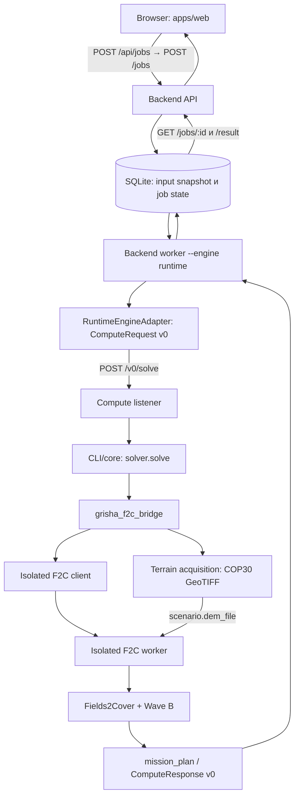
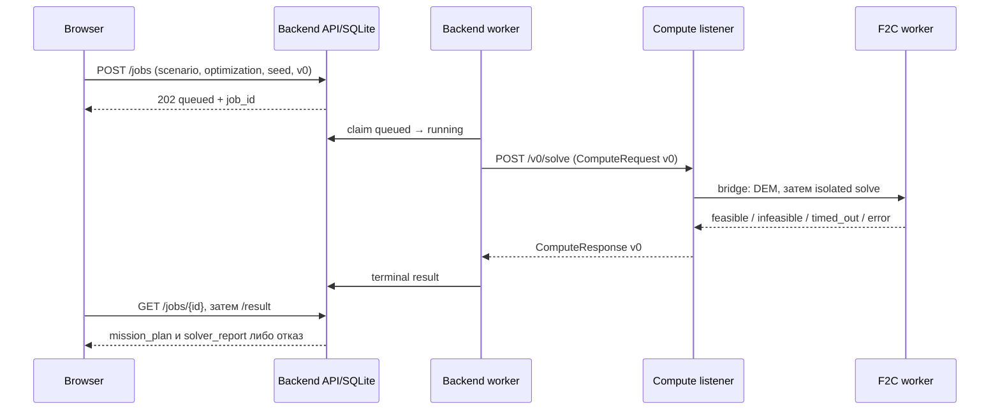
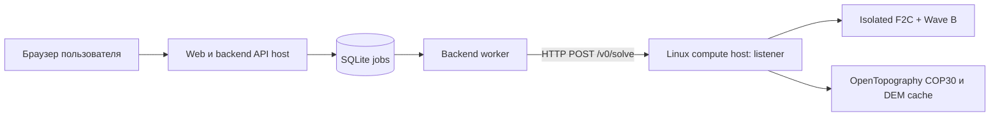

# planes — техническая документация системы

Этот документ описывает реализованный контур репозитория, а не обещанную полноту продукта. Быстрый локальный запуск — в [README](../README.md), требования заказчика и открытые вопросы — в [docs/spec](spec/README.md). Подробные решения и проверки доступны по ссылкам ниже. Контракт публичного compute-обмена — `v0`.

## 1. Назначение системы

`planes` — прототип веб-сервиса группового планирования авиационной съёмки БВС. Пользователь задаёт KML области съёмки и при необходимости ограничений, аэродромы, состав бортов и камер, GSD, перекрытия, ветер и критерий расчёта. Система возвращает состояние задания, а при допустимом решении — план миссии с маршрутами, точками, высотами, временем и отчётом солвера. План имеет эвристический характер и не является разрешением на полёт.

## 2. Сквозная архитектура



API сохраняет входной `scenario` без обогащения из каталога. Worker извлекает queued job, может отклонить ветер до runtime, затем вызывает порт `OptimizationEngine`. Адаптер доставляет версионированный запрос compute-слушателю; listener запускает отдельный CLI/ядро. Bridge проверяет спектр и обеспечивает DEM до запуска изолированного worker. Backend сохраняет terminal result, браузер опрашивает статус и показывает карту. Подробные границы — [SYSTEM_BOUNDARIES](architecture/SYSTEM_BOUNDARIES.md).

Разделение решает конкретную задачу эксплуатации. Отправка из браузера быстро создаёт job и возвращает `job_id`; тяжёлый расчёт не удерживает исходный HTTP-запрос открытым. SQLite связывает API и worker устойчивым снимком входа и состоянием, поэтому браузер может вернуться за результатом позднее. Backend остаётся относительно лёгким: native-библиотеки Fields2Cover, растры и ключ OpenTopography живут на Linux compute host. Через порт `OptimizationEngine` и обмен `v0` backend не зависит от внутренней реализации планировщика. Это границы процессов текущего приложения, без отдельного message broker или заявлений о распределённой БД.



## 3. Ответственность компонентов

| Компонент | Реализация | Ответственность |
|---|---|---|
| Web | [`apps/web`](../apps/web/src/App.tsx), [`scenario.ts`](../apps/web/src/scenario.ts) | KML upload/preview, проверка формы, сбор JSON, polling и карта |
| Backend API | [`api.py`](../src/planes/backend/api.py), [`service.py`](../src/planes/backend/service.py) | `POST /jobs`, status/result, валидация и HTTP-ответы |
| SQLite | [`store.py`](../src/planes/backend/store.py) | снимок входа, состояния и результат |
| Worker | [`worker.py`](../src/planes/backend/worker.py) | claim задачи, prefilter ветра, вызов engine, terminal state |
| Runtime adapter | [`adapter.py`](../src/planes/runtime/adapter.py) | транспорт backend ↔ compute по `v0` |
| Compute listener | [`http_server.py`](../src/planes/runtime/http_server.py) | `/health`, Bearer `/v0/solve`, один вычислительный слот и отдельный процесс |
| Bridge | [`grisha_f2c_bridge.py`](../src/planes/runtime/grisha_f2c_bridge.py) | проверка спектра, canonical rectangle, DEM, передача isolated solver |
| Terrain | [`src/planes/integration/terrain`](../src/planes/integration/terrain/) | COP30, валидация полного покрытия, кеш GeoTIFF |
| Isolated F2C | [`tools/f2c_iso`](../tools/f2c_iso/) | KML/constraints, геометрия, Fields2Cover, маршрут и Wave B |
| Catalog | [`catalog/fleet_catalog.json`](../catalog/fleet_catalog.json) | физические и оптические параметры, совместимость |
| Model | [`src/planes/model`](../src/planes/model/) | отдельные библиотечные реализации и исторический optimizer; основной iso-контур не импортирует весь `mvp_optimizator` |

### Где находится логика

| Задача | Владелец в текущем контуре |
|---|---|
| KML upload, первичный parsing, сводка и preview JSON | Frontend `kml.ts`, `scenario.ts`, `App.tsx` |
| Проверка формы и фильтрация выбора камеры | Frontend `scenario.ts`; далее независимые server-side проверки |
| Проверка HTTP job, снимок входа и состояния | Backend API/`BackendService`/`SQLiteJobStore` |
| Очередь и атомарный выбор job | Таблица `jobs`, `SQLiteJobStore.claim_next_queued_job()` |
| Ранний фильтр скорости ветра | Backend worker, `wind_filter.py` |
| Доставка `ComputeRequest v0` | `RuntimeEngineAdapter` → HTTP compute listener |
| Спектр и canonical terrain rectangle | Runtime `grisha_f2c_bridge` |
| COP30, GeoTIFF validation/cache | Compute-side integration terrain |
| Препятствия, разбиение и swaths | Isolated worker и Fields2Cover |
| Вылеты, дозарядка, разведение | Wave B |
| Status polling, summary, карта | Frontend `api.ts`, `App.tsx`, `MissionMap.tsx` |

## 4. Структура репозитория

| Каталог | Назначение |
|---|---|
| [`apps/web/`](../apps/web/) | React/TypeScript UI, Vite proxy, frontend-тесты и демо-KML. |
| [`src/planes/backend/`](../src/planes/backend/) | Локальный HTTP API, SQLite, worker, коды ошибок. |
| [`src/planes/runtime/`](../src/planes/runtime/) | Compute listener, adapter, solver selection, bridge, каталог для runtime. |
| [`src/planes/integration/`](../src/planes/integration/) | Стыковки подсистем, включая получение и проверку terrain. |
| [`src/planes/contracts/`](../src/planes/contracts/) | Версионированные схемы/порты; менять только отдельной contract-задачей. |
| [`src/planes/model/`](../src/planes/model/) | Математические и ранее интегрированные модели; не следует считать каждый кодовый путь живым. |
| [`tools/f2c_iso/`](../tools/f2c_iso/) | Отдельный Python-процесс планирования на Fields2Cover. |
| [`catalog/`](../catalog/) | JSON флота для isolated worker. |
| [`tests/`](../tests/) | Backend/runtime/integration/model проверки. |
| [`infra/`](../infra/) | systemd unit, шаблон окружения, bootstrap и [runbook](../infra/runbook.md). |
| [`docs/`](./) | Требования, архитектура, workstreams, статусы и доказательства. |
| [`.github/workflows/`](../.github/workflows/) | CI, включая ручной terrain E2E. |

## 5. Входной сценарий

Форма в [`buildPrototypeScenario`](../apps/web/src/scenario.ts) передаёт `scenario_id`, `crs="EPSG:4326"`, `survey_kml` как исходный текст, опциональный `constraints_kml`, `gsd_cm_per_px`, `survey.forward_overlap` и `survey.side_overlap` (доли), `wind.speed_ms` и `wind.direction_deg`, `criterion`, `required_spectrum`/`survey_type`, `aerodromes` и `boards`. Альтернативный runtime-вход `areas` существует для программных клиентов; браузер отправляет KML. Отдельный `optimization` несёт `objective` и `time_limit_seconds`, верхний запрос — `seed` и `contract_version="v0"`. В браузере KML разбирается для preview/валидации, но в scenario остаётся исходный KML, а сервер разбирает геометрию для расчёта.

Каждый аэродром — `id`, `lat`, `lon` в WGS84. `board.aerodrome_id` связывает его с бортом; выбранные аэродромы определяют взлёт/посадку и расширяют canonical DEM rectangle вместе с областью съёмки. Каждая карточка `board` содержит `id`, `model_id`, `camera_id`, `aerodrome_id`, `count`. Браузер выбирает идентификаторы, а физические числа/оптика берутся на compute-стороне из каталога. Форма допускает 1–4 аэродрома. `survey.strip_direction_deg` старого клиента на iso-пути игнорируется: heading выбирает F2C ([input contract](f2c-input-contract.md)).

Ограничения: `constraints_kml` **доходит** до isolated worker, разбирается в `obstacles`, попадает в `mission_plan.obstacles` и вычитается из геометрии покрытия перед генерацией swaths ([реализация](../tools/f2c_iso/fields2cover_engine_iso.py)). Это геометрические препятствия текущего алгоритма, не полноценная проверка воздушного пространства/3D NFZ. Их вершины **не** расширяют terrain rectangle; тот строится из наружных колец survey и всех аэродромов.

### Frontend preprocessing и его граница

[`readKmlFile`](../apps/web/src/kml.ts) читает `.kml`, `parseKml` проверяет XML/KML и собирает сводку документов, placemarks, геометрий, координат, высот и bounding box, а также SHA-256 и исходный текст. `App.tsx` показывает эту сводку и read-only JSON preview. `extractKmlPolygons` проверяет наличие наружного кольца survey перед отправкой. Форма проверяет аэродромы, карточки бортов, GSD, перекрытия и ветер; затем `buildPrototypeScenario` сериализует выбранные значения и **исходные тексты** KML. Это даёт пользователю быструю обратную связь без server round-trip и не отправляет заведомо неполную форму.

Frontend **не** обрезает полигон до прямоугольника и не строит canonical terrain rectangle. Функции `ringBounds`/`ringIntersectsBounds` есть в `kml.ts`, но текущий submit path их не вызывает. В worker KML разбирается заново для solver geometry; в runtime из survey outer rings и всех аэродромов строится DEM rectangle. Browser preview и проверки удобны для UX, но не являются авторитетной проверкой геометрии, совместимости и DEM для планировщика. Ключ OpenTopography браузеру не передаётся.

## 6. Каталог БВС и камер

Серверный isolated worker читает [`catalog/fleet_catalog.json`](../catalog/fleet_catalog.json) (переопределение `PLANES_FLEET_CATALOG`), а bridge сверяет спектр по [`src/planes/runtime/catalog/fleet_catalog.json`](../src/planes/runtime/catalog/fleet_catalog.json). Frontend использует runtime-копию для выбора модели и камеры. Данные содержат модели, камеры, рёбра совместимости и спектры, скорости, длительность полёта, запас, оптику и пометки происхождения: `passport`, `estimate`, `calculation`, местами `synthetic`. Не вся паспортная информация участвует в расчёте: например, energy Wh не служит полным энергобалансом. Сверяйте копии при изменениях каталога; [историческая матрица](architecture/FLEET_CATALOG_SWEEP.md) относится к прежним путям.

UI фильтрует камеры по модели и выбранному спектру. Bridge проверяет `required_spectrum` (или `survey_type`) по `camera.spectra` **до** DEM: при несовпадении хотя бы одной карточки весь запрос получает `infeasible` с пояснением; он не пропускает такой борт молча. Если camera ID неизвестен и спектр запрошен, эта же ранняя проверка также может вернуть `infeasible`; без неё isolated worker отклоняет неизвестные ID или несовместимую пару как ошибку входа. Известные сигналы отображаются через [коды ошибок](architecture/API_RESULT_CODES_V0.md).

Политика выбора: `model_id` + ребро `compatibility` + `required_spectrum` среди `camera.spectra` → допустимые пункты списка в UI. Смена модели сбрасывает неподходящую камеру; смена типа съёмки может выбрать первую подходящую. На сервере bridge независимо отклоняет несовпадение спектра, а isolated worker проверяет существование модели/камеры и ребро совместимости в каталоге. Следовательно, UI предотвращает обычную ошибку выбора, а server-side расчёт не полагается на UI как на единственный источник валидности.

### Ранний фильтр ветра

После claim job backend worker сравнивает `scenario.wind.speed_ms` с известными `max_wind_m_s` выбранных моделей из runtime-каталога. Если скорость **строго выше максимума известных лимитов**, [`wind_filter.py`](../src/planes/backend/wind_filter.py) возвращает `infeasible` (`method=api_wind_filter`) без вызова compute. Неизвестные/неположительные лимиты не поднимают этот максимум; если все лимиты неизвестны, проверка пропускается. Это фактическое правило кода, а не доказательство полной ветровой модели для всего флота: направление, порывы и профиль ветра здесь не анализируются. Быстрый отказ экономит тяжёлый вызов, когда текущая проверка нашла превышение.

## 7. Жизненный цикл job и solver outcome

Backend сохраняет `queued → running → completed | failed | timed_out`. `completed` может содержать как `feasible`, так и `infeasible`: состояние job говорит об исполнении, `outcome` — о результате солвера. `feasible` даёт `mission_plan`, `infeasible` означает отсутствие решения в текущих условиях и не означает сбой инфраструктуры. `timed_out` — исчерпанный лимит, `error` — технический отказ. Недоступный/невалидный DEM на живом bridge относится к `error`, не к `infeasible`; ошибка транспорта/авторизации также не маскируется под геометрическую невозможность. После смерти worker восстановление `running` автоматически не реализовано.

### Job lifecycle and queue policy

[`BackendService.submit_job`](../src/planes/backend/service.py) присваивает UUID (если клиент не передал `job_id`), сериализует `scenario` и `optimization` как конечный JSON и создаёт запись `queued`. В таблице SQLite `jobs` хранятся `job_id`, версия контракта, **неизменяемый снимок** `scenario_json`/`optimization_json`, `seed`, `state`, отдельные `result_json` или `error_json` и отметки времени. Исходный HTTP `POST /jobs` отвечает `202` до вычисления. API и worker используют один SQLite-файл; это граница передачи задания, не брокер сообщений.

[`claim_next_queued_job`](../src/planes/backend/store.py) в `BEGIN IMMEDIATE` выбирает первую задачу по `created_at, job_id` и условным `UPDATE` переводит её в `running`, не позволяя двум worker забрать одну запись. Worker запускается однократно либо с `--loop` (опрос пустой очереди через 0,5 с), делает фильтр ветра и вызов engine, затем сохраняет terminal response. `feasible` и `infeasible` переводят job в `completed`, `timed_out` — в `timed_out`, `error` и исключение worker — в `failed`. Состояние и результат хранятся отдельно; `GET /jobs/{id}/result` возвращает `409`, пока job `queued`/`running`. В браузере [`pollJobLifecycle`](../apps/web/src/api.ts) запрашивает status примерно раз в секунду и только после terminal state получает result. Для восстановления зависшей `running` после гибели worker автоматической процедуры пока нет.

### Значение terminal outcome

| `outcome` | Что означает в реализованной модели | Пример |
|---|---|---|
| `feasible` | Алгоритм построил план, проходящий его текущие проверки; не гарантия глобального оптимума или допуска к полёту. | F2C получил полосы, Wave B уложил их в вылеты, DEM пригоден. |
| `infeasible` | В текущих входах/ограничениях допустимый план не получен. Job при этом `completed`. | Спектр камеры не подходит; не удалось покрыть полосы в endurance; скорость ветра выше известного предела. |
| `error` | Технический, конфигурационный или входной отказ вычислительного пути; job `failed`. | Нет ключа COP30, GeoTIFF не покрывает прямоугольник, compute вернул HTTP 401. |
| `timed_out` | Истёк лимит solve или ожидания compute; job `timed_out`. | Сценарий не завершён за `time_limit_seconds`. |

## 8. HTTP и Compute v0

Публичный backend предоставляет `POST /jobs` (успешно `202` и `Location`), `GET /jobs/{job_id}` и `GET /jobs/{job_id}/result` (`409`, пока результат не готов). Максимальное тело `POST /jobs` — 10 МиБ. В Vite browser обращается к `/api/jobs`, проксируемому на backend `/jobs`. Compute listener предоставляет `GET /health` без токена (`live`, `v0`) и Bearer-protected `POST /v0/solve`; занятому слоту соответствует HTTP `503`, неверному токену `401`.

`ComputeRequest v0` содержит `contract_version`, `job_id`, `scenario`, `optimization`, `seed`. `ComputeResponse v0` — `outcome`, `mission_plan` при наличии, `solver_report`, `artifacts`. Детальные схемы и правила — [INTERFACES_V0](architecture/INTERFACES_V0.md). Terrain передаёт локальный `scenario.dem_file` **внутри runtime**, не добавляя полей в публичные HTTP/compute DTO: изменения контракта `v0` нет.

Backend worker передаёт запрос через [`RuntimeEngineAdapter`](../src/planes/runtime/adapter.py): JSON `POST http://$COMPUTE_HOST:8080/v0/solve` с `Authorization: Bearer $COMPUTE_TOKEN`, `Content-Type: application/json` и client timeout. Listener проверяет токен, запускает CLI/subprocess и возвращает `ComputeResponse v0`. Отдельный `GET /health` сообщает лишь, что listener доступен и знает `v0`; он не запускает F2C и не проверяет DEM. Backend вызывает порт `OptimizationEngine`, поэтому смена внутреннего solver при том же `v0` не меняет API постановки job. На compute host можно изолировать тяжёлые Linux-зависимости от web/API host и разворачивать их отдельно. Переключение исходного кода и реальное развёртывание требуют собственных проверок.

Сокращённый **пример тела `POST /jobs`**. `"<KML omitted>"` означает замену на настоящий KML; такой placeholder не является исполнимой геометрией:

```json
{
  "contract_version": "v0",
  "scenario": {
    "scenario_id": "demo-1",
    "crs": "EPSG:4326",
    "criterion": "min_time",
    "survey_kml": "<KML omitted>",
    "constraints_kml": "",
    "required_spectrum": "RGB",
    "gsd_cm_per_px": 3,
    "survey": {"forward_overlap": 0.7, "side_overlap": 0.6},
    "wind": {"speed_ms": 2, "direction_deg": 270},
    "aerodromes": [{"id": "a1", "lat": 55.75, "lon": 37.6}],
    "boards": [{"id": "b1", "model_id": "geoscan-gemini", "camera_id": "geoscan-pf1b", "aerodrome_id": "a1", "count": 1}]
  },
  "optimization": {"objective": "min_time", "time_limit_seconds": 90},
  "seed": 7
}
```

`POST /jobs` возвращает `job_id`/`state=queued`; worker добавляет `job_id` к `ComputeRequest`. Ниже **сокращённая форма** успешного `ComputeResponse` (многие route/area/validation поля опущены ради читаемости, числа условные); API result дополнительно содержит `state=completed`:

```json
{
  "contract_version": "v0",
  "job_id": "demo-job-1",
  "outcome": "feasible",
  "mission_plan": {
    "solver": "grisha_mvp_fields2cover",
    "criterion": "min_time",
    "routes": [{"uav_id": "b1", "takeoff_vpp_id": "a1", "landing_vpp_id": "a1", "waypoints": [{"lat": 55.75, "lon": 37.6, "alt_m": 245.2}]}],
    "mission": {"mission_time_s": 480, "total_flight_time_s": 480}
  },
  "solver_report": {"method": "grisha_mvp_fields2cover_isolated", "objective": "min_time", "runtime_seconds": 3.2, "seed": 7, "limitations": ["heuristic result is not globally optimal"]},
  "artifacts": []
}
```

При `infeasible` `mission_plan` равен `null`, а причина находится в `solver_report.limitations`; при техническом `error` план также отсутствует, а backend возвращает `state=failed` и UI-классификацию, когда сигнал распознан. Реальные поля и правила сериализации определяют [runtime types](../src/planes/runtime/types.py), [backend models](../src/planes/backend/models.py) и [HTTP API](../src/planes/backend/api.py), а не пример.

## 9. Solver и Fields2Cover

При `PLANES_SOLVE_BACKEND` unset или `grisha_f2c_iso` [`solver.solve`](../src/planes/runtime/solver.py) направляет geo-envelope (`aerodromes` + `boards`) в bridge и изолированный клиент. Явные `legacy_fields2cover`, `legacy`, `geo_mission` выбирают rollback-реализацию; её результаты и terrain-политику нельзя переносить на default path. Подробности — [live iso](live-grisha-f2c-iso.md).

В Linux E2E используется Fields2Cover **2.1.0**. Он разлагает область и строит полосы; `SG_BruteForce.generateBestSwaths` выбирает heading по поддерживаемой F2C цели. Это не доказательство глобального оптимума всей групповой миссии. Изолированный процесс очищает конфликтующие Python-пути; запуск зависит от отдельного embed Python с F2C и OR-Tools.

## Алгоритмическое вычислительное ядро

Основной planning path состоит из явных преобразований данных и геометрии, Fields2Cover и эвристических правил Wave B. Он не вызывает LLM, нейросетевого агента или непрозрачный ML planner. Это архитектурное свойство полезно при разборе решения: можно проследить входной KML, выбранные записи каталога, obstacle geometry, validated DEM, созданные swaths, назначенные sorties и итоговый `mission_plan`. Не следует из этого делать вывод о глобальной оптимальности или о полной детерминированности всех внешних зависимостей.


### Проверяемые условия и эвристические решения

Жёсткие проверки имеют разные исходы. Несовпадение `required_spectrum` с `camera.spectra` даёт `infeasible` до DEM; эта ранняя проверка также трактует неизвестную камеру как несовпадение спектра, если спектр задан. Isolated worker отдельно отклоняет неизвестную модель/камеру, отсутствие ребра совместимости и некорректный аэродром как ошибку входа (`error` через runtime pipeline), если запрос дошёл до него. DEM на canonical path обязателен, должен быть читаемым и покрывать весь прямоугольник; нарушение — технический `error`. Препятствия геометрически вычитаются из survey-полигонов до swaths; непокрытые полосы при ограничении endurance дают `infeasible`. Дополнительная строгая проверка terrain clearance применяется только при `strict_terrain_check=true`; её нарушение даёт `infeasible`.

Выбор порядка и распределения полос, подходящего старта/посадки, повторных вылетов, пауз дозарядки и временных задержек разведения выполняется эвристически. Это *heuristic decisions/preferences*, не формальная гарантия лучшего решения по всей области вариантов. Разведение оценивается горизонтально и дискретно; полная 3D flight-safety проверка отсутствует.

### Объяснимость и воспроизводимость

`solver_report.method`, `solver_report.limitations` и данные `mission_plan` показывают использованный контур и ограничения результата. Для известных отказов backend добавляет `error_code`, `message_ru`, `message_en` и `details` в API result; классификация не меняет сохранённый solver response ([коды](architecture/API_RESULT_CODES_V0.md)). Можно отдельно проверить: валидацию формы, spectrum mismatch, wind prefilter, DEM acquisition, отсутствие swaths, endurance, timeout и ошибку listener. Совпадающие вход, каталог, конфигурация и версии библиотек позволяют повторить контролируемый сценарий; внешний OpenTopography и временные лимиты требуют отдельной фиксации условий.

Frontend отправляет фиксированный `seed=7`. Текущий isolated F2C worker переносит seed в отчёт, но не использует его для выбора маршрута; поэтому seed **не** следует выдавать за переключатель разных решений этого контура. Алгоритмические функции и небольшие fixtures позволяют сравнивать параметры в тестах, но production A/B-платформы в проекте нет. Проверки включают unit/regression tests, синтетические сценарии и GeoTIFF, а также ручной Linux E2E с реальным OpenTopography и Fields2Cover; см. [раздел тестирования](#17-тестирование-и-ci).

## 10. Wave B и критерии

После генерации полос [`Wave B`](../tools/f2c_iso/iso_src/wave_b.py) эвристически распределяет их по бортам/вылетам с ограничением по эффективной длительности полёта, допускает повторные вылеты и паузы дозарядки, посадку на другом аэродроме, опционально чужой старт и горизонтальное разведение задержкой по временным конфликтам. `allow_foreign_takeoff` по умолчанию `false`, recharge и foreign landing — `true`. Это приближение, а не сертифицированное управление конфликтами.

Две рассчитываемые метрики имеют разные единицы смысла, хотя обе выражены в секундах. `mission_time_s` (`Cmax`) — время до завершения всей групповой работы с учётом пауз дозарядки и задержек разведения; `total_flight_time_s` — сумма времени **в воздухе** по всем вылетам без этих пауз. Например, два параллельных полёта по 10 минут дают около 10 минут `Cmax` и около 20 минут суммарного налёта. `min_time` выбирает первую метрику для `objective_value`/UI, `min_flight_hours` — вторую. Точная формализация целей — `TEAM-DECISION` по [OPEN-006](spec/OPEN_QUESTIONS.md).

**Ограничение текущей реализации:** [`fields2cover_engine_iso.py`](../tools/f2c_iso/fields2cover_engine_iso.py) строит swaths и укладывает вылеты без чтения выбранного `criterion`; [`f2c_isolated_worker.py`](../tools/f2c_iso/f2c_isolated_worker.py) возвращает обе метрики, а bridge выбирает значение отчётной цели уже после построения плана. Поэтому выбор режима в текущем iso-контуре **не доказан как изменение самого маршрута/расписания**. Это частичная реализация `REQ-OPT-001`–`003`, а не доказанная оптимизация по двум различным целям; нужен отдельный алгоритмический follow-up и тест, показывающий изменение выбора плана.

## 11. Terrain

Живой bridge берёт наружные кольца `survey_kml`/`areas` и **все** аэродромы, строит прямоугольник EPSG:4326 с нулевым mission padding, затем для COP30 HTTP добавляет наружу технический guard по одной 1-arcsecond ячейке. OpenTopography отдаёт GeoTIFF; код проверяет читаемость, CRS, конечные высоты и **полное покрытие** исходного прямоугольника, кеширует растр и передаёт путь как `scenario.dem_file`. Isolated worker использует `_GeoTiffDem`. Отсутствие ключа, ошибка загрузки или невалидный DEM прекращает расчёт техническим `outcome=error`; silent flat/mono fallback в этом живом bridge отсутствует. Standalone helper и rollback имеют отдельную совместимую политику. Подробности и границы — [TERRAIN_PIPELINE](architecture/TERRAIN_PIPELINE.md).

Для survey waypoint `alt_m` — ASL (*Above Sea Level*): `DEM.h(lat, lon)` (высота земли ASL) + `h_agl_m` (AGL, *Above Ground Level*, рабочая высота камеры). Длительность пока считается по двумерной длине и скорости; набор/снижение, вертикальная энергия, 3D длина и полноценный terrain corridor не учтены (`OPEN-012`).

Опциональный [Actions terrain E2E](../.github/workflows/terrain-e2e.yml), [run 36614598024](https://github.com/anabol21/planes/actions/runs/36614598024) на `ubuntu-latest` для исходного HEAD `85f88fbf785ebcf1d942a08cc966b92be5e25cc8`, прошёл с реальным OpenTopography HTTP 200, COP30 GeoTIFF, F2C 2.1.0/OR-Tools 9.9.3963, subprocess, `feasible` final mission и DEM-зависимыми высотами. Это доказательство интеграции кода, **не** свидетельство развёртывания в production.

## 12. Выходной mission plan

При `feasible` `mission_plan` содержит идентификаторы/метаданные метода (`solver`, `decomposition_method`, `engine`), критерий, `routes` с `uav_id`, стартовым/посадочным `vpp_id`, индексом вылета, временем старта и `waypoints` (`lat`, `lon`, `alt_m`), `mission.mission_time_s`, `mission.total_flight_time_s`, геометрию `areas`/`obstacles`. Ограничения и метод также находятся в отдельном `solver_report`. Фактический сериализатор — [`f2c_isolated_worker.py`](../tools/f2c_iso/f2c_isolated_worker.py). `alt_m` на survey-точках относится к ASL; это не готовая проверенная команда автопилоту. Frontend показывает summary, карту и raw response JSON. Для карты линии маршрутов обрезаются по областям съёмки: видны только участки внутри них, чтобы не нагружать карту транзитными линиями; полный `mission_plan` и raw JSON сохраняются без изменений. Кнопки экспорта KML/GeoJSON в текущем `ResultPanel` нет.

## 13. Ошибки

Frontend и API проверяют обязательные поля и JSON; неверный запрос получает `400`, слишком большое тело тоже отклоняется до постановки. Worker/runtime различают конфигурацию, транспорт, токен (`401` compute), занятость listener (`503`), terrain, сбой subprocess, `infeasible` и timeout. Backend нормализует известные исходы в `error_code`, `message_ru`, `message_en`, `details` для UI; перечень и границы классификации — [API_RESULT_CODES_V0](architecture/API_RESULT_CODES_V0.md). Свободный текст/внутренние детали не должен становиться обещанием стабильного контракта.

## 14. Переменные окружения и секреты

Требуемые переменные зависят от процесса. `COMPUTE_HOST` — фактическое имя в [`adapter.py`](../src/planes/runtime/adapter.py); `COMPUTE_SSH` в текущем коде не используется. Адрес должен быть именем/адресом **без схемы и порта** (адаптер добавляет `http://` и `:8080`).

| Variable | Где требуется | Назначение | Секрет |
|---|---|---|---|
| `COMPUTE_HOST` | Backend worker `--engine runtime` | Адрес compute listener. | Нет; не публиковать production-адрес без необходимости. |
| `COMPUTE_TOKEN` | Backend worker и compute listener | Общий Bearer token для `POST /v0/solve`. | **Да** |
| `COMPUTE_TIMEOUT_SECONDS` | Backend worker | Предел ожидания HTTP; нужен запас сверх `optimization.time_limit_seconds`. | Нет |
| `OPENTOPOGRAPHY_API_KEY` | Compute runtime при реальном COP30 download | Серверный ключ OpenTopography; без него live bridge завершится terrain error, если нет пригодного DEM. | **Да** |
| `PLANES_SOLVE_BACKEND` | Compute, необязательно | Default `grisha_f2c_iso`; явный rollback `legacy_fields2cover`. | Нет |
| `F2C_EMBED_PYTHON` | Compute, при нестандартном embed path | Python с Fields2Cover/OR-Tools; иначе поиск по deploy root. | Нет |
| `PLANES_GRISHA_ROOT` | Compute, необязательно | Deploy root для запасного поиска isolated scripts/embed venv. | Нет |
| `PLANES_F2C_CLIENT`, `PLANES_F2C_WORKER` | Compute, необязательно | Переопределения путей isolated client/worker. | Нет |
| `PLANES_FLEET_CATALOG` | Isolated worker, необязательно | Путь к JSON каталога; default in-repo `catalog/fleet_catalog.json`. | Нет |
| `PLANES_DEM_CACHE`, `PLANES_TERRAIN_CACHE_DIR` | Compute, необязательно | Место кеширования DEM. | Нет |
| `PLANES_DEM_PADDING_M`, `PLANES_DEM_FAIL_CLOSED` | Только для standalone helper policy | Canonical live bridge всё равно использует нулевой mission padding и `require_terrain=True`. | Нет |

Безопасный пример для shell backend worker:

```bash
export COMPUTE_HOST="<compute-host>"
export COMPUTE_TOKEN="<secret>"
export COMPUTE_TIMEOUT_SECONDS="620"
```

На **compute host**, отдельно от frontend/backend:

```bash
export COMPUTE_TOKEN="<same-secret>"
export OPENTOPOGRAPHY_API_KEY="<secret>"
export F2C_EMBED_PYTHON="<path-to-embed-python>"
```

Для локального PowerShell backend worker используются `$env:COMPUTE_HOST = "<compute-host>"`, `$env:COMPUTE_TOKEN = "<secret>"`, `$env:COMPUTE_TIMEOUT_SECONDS = "620"`. Значения приведены как placeholders; лимит ожидания подбирается под задачу. Секреты остаются в окружении или защищённом env-файле: не помещайте их в git, browser, scenario, логи, документацию или URL с credential. Шаблон — [`infra/planes-compute.env.example`](../infra/planes-compute.env.example). Текущий adapter использует HTTP к compute; безопасность сети/канала — отдельное требование эксплуатации.

## 15. Локальная разработка и запуск одной командой

Предпочтительный локальный запуск на macOS/Linux — `bash scripts/run-local.sh` из корня. Скрипт требует `./.venv/bin/python`, установленные frontend-зависимости/`pnpm`, доступные `lsof`/`pgrep` и свободные порты `8000`/`5173`; при наличии читает локальный `.env`. Он запускает API, backend worker `--engine runtime --loop` и Vite, оба backend-процесса используют `./local-run.sqlite3`. `Ctrl-C` останавливает только запущенные им процессы. Скрипт **не** запускает compute listener, isolated F2C, OpenTopography или production deployment автоматически: для реального solve нужны отдельный Linux compute host и переменные из раздела выше. Единой команды развёртывания всего production stack здесь нет.

Для lightweight разработки можно использовать те же web/API/SQLite процессы с `--engine fake`: он проверяет job lifecycle и возвращает синтетический результат, не строя маршрут. Вручную: запустите `python -m planes.backend.api --database ./demo.sqlite3 --host 127.0.0.1 --port 8000` при `PYTHONPATH=src`; в `apps/web` — `pnpm install`, `pnpm dev`; затем backend worker **с тем же SQLite**: `python -m planes.backend.worker --database ./demo.sqlite3 --engine runtime` с compute env или `--engine fake` для lifecycle. `--loop` непрерывно опрашивает очередь, без него один job за запуск. Полные команды — в [README](../README.md).

Нативный Windows подходит для UI/API/backend и большинства dependency-free тестов. Production-подобный isolated F2C/terrain требует Linux-окружения с F2C/OR-Tools/rasterio; POSIX `fcntl` в runtime-процессе исключает обещание полной parity на native Windows. Проверенный Linux путь зафиксирован в CI.

## 16. Развёртывание



Web, API, SQLite и worker могут находиться на одной машине при общем доступе API и worker к **одному** файлу SQLite. Compute отделён HTTP-границей и может работать на другом Linux host с native F2C/OR-Tools/rasterio. В репозитории нет конфигурации Kubernetes или контейнерного оркестратора для этого пути. Backend worker не скачивает DEM; ключ OpenTopography хранится на compute host, token известен worker/listener, но не браузеру.

Compute listener запускается отдельным сервисом [`planes-compute.service`](../infra/planes-compute.service): пользователь `planes`, рабочий каталог `/opt/planes`, env-файл `/etc/planes/planes-compute.env`, порт `8080`, `Restart=on-failure`. `GET /health` проверяет доступность listener и версию контракта, но не доказывает исправность OpenTopography или дочернего F2C. Перед переключением действующего сервиса нужно установить Linux-зависимости, ключ/токен вне git и проверить реальный `/v0/solve`; шаги — [infra/runbook](../infra/runbook.md). Исторический health или успешный CI не означает, что terrain-enabled commit уже развёрнут.

## 17. Тестирование и CI

Проверки разделены по уровням: `tests/backend` для API/SQLite/worker, `tests/runtime` для v0/listener/solver/bridge, `tests/integration` для terrain, `apps/web` для KML/form/API, изолированные тесты F2C и синтетические GeoTIFF для границ/высот. `python scripts/validate_workspace.py` проверяет governance/структуру. Frontend: `pnpm typecheck`, `pnpm test`, `pnpm build`. Проверяйте real path отдельно от fake engine.

Ручной [`terrain-e2e.yml`](../.github/workflows/terrain-e2e.yml) использует GitHub Actions secret `OPENTOPOGRAPHY_API_KEY`, Linux, реальные COP30 HTTP и isolated F2C. Он opt-in, зависит от внешнего сервиса и не запускается как обычный быстрый unit-test. Зафиксированные fixtures/версии, одинаковый вход и конфигурация нужны для сравнения регрессий; `seed=7` в текущем iso worker только отражается в отчёте и не управляет выбором маршрута. Контролируемое сравнение набора параметров возможно тестами, но production A/B-платформа отсутствует. Подробное terrain evidence — [terrain pipeline](architecture/TERRAIN_PIPELINE.md) и [статус интеграции](status/integration.md).

## 18. Известные ограничения

| Область | Текущее ограничение |
|---|---|
| Оптимальность | F2C + Wave B дают эвристический план без доказательства глобального оптимума. |
| Выбор критерия | Обе метрики рассчитываются, но `criterion` не участвует в выборе маршрута текущего iso planner; выбор влияет на отчётную целевую метрику. |
| Рельеф/время | Survey высоты terrain-aware; длительность, набор/снижение, энергия и corridor не полная 3D-модель. |
| Энергия | Ограничение вылетов опирается на endurance/резерв; `energy_wh` не используется как полный физический баланс, recharge — временной gap. |
| Ветер | Текущий prefilter/расчёт использует модуль ветра; направление не становится полноценной ветровой динамикой. |
| Совместный полёт | Горизонтальная задержка/буфер — эвристика, не сертифицированная 3D-де-конфликтация. |
| Ограничения | `constraints_kml` доходит до F2C как `obstacles` и влияет на swaths, но не формирует полный 3D/NFZ safety case и не расширяет DEM rectangle. |
| Экспорт | UI показывает JSON/карту, но download KML/GeoJSON не реализован: `REQ-OUT-007`, `REQ-DEMO-005` не закрыты. |
| Очень большой KML | Текущий `kml.ts:outerRing` использует `Math.max(...altitudes)`; большие кольца с множеством высот могут превысить лимит аргументов браузера до отправки job. Нужен отдельный frontend fix. |
| Надёжность | Автовосстановление зависших `running` после сбоя worker не реализовано. |
| Эксплуатация | Совместимость с конкретным ПО Геоскана и flight-safety сертификация не доказаны; CI не заменяет deployment test. |

## 19. Трассировка требований

Категории требований и их приоритет (`TZ-MUST`, `TZ-SHOULD`) определены в [REQUIREMENTS](spec/REQUIREMENTS.md); `TEAM-DECISION`, `TEAM-ASSUMPTION` и `OPEN` не являются требованиями заказчика. Полная исходная матрица — [TRACEABILITY](spec/TRACEABILITY.md), открытые решения — [OPEN_QUESTIONS](spec/OPEN_QUESTIONS.md). Эта таблица — срез реализации, а не пересмотр статуса исходного ТЗ.

| Область | Реализация | Статус/доказательство |
|---|---|---|
| Web service | React UI, HTTP API, SQLite/worker | Реализовано; frontend/backend тесты, исходники. |
| Input | KML survey, constraints, аэродромы, boards, параметры | Реализовано в форме/bridge; полные внешние форматы/валидации требуют отдельной оценки. |
| Fleet | Каталог моделей/камер, compatibility и spectrum | Реализовано частично; часть чисел оценочная. |
| Planning | F2C swaths, маршруты и Wave B | Прототип проверен; safety/3D полнота не доказана. |
| Optimization | `min_time` / `min_flight_hours` | Обе метрики выводятся; влияние выбора критерия на сам план в iso path отсутствует. Частично; `OPEN-006` и отдельный алгоритмический follow-up. |
| Terrain | COP30, canonical rectangle, validated DEM → altitude | Реальный Linux E2E прошёл; 2D duration остаётся ограничением. |
| Output | Mission plan/карта/JSON | Частично: KML/GeoJSON export отсутствует. |
| Demo | Локальные fixtures, UI lifecycle, реальный terrain CI | Демо-контур есть; end-user deployment на этом commit отдельно не доказан. |
| Deployment | systemd unit, env template, runbook | Артефакты есть; факт развёртывания terrain-enabled tip из CI не следует. |
| Documentation | Этот обзор + профильные документы | Документация описывает реализованный срез; внешние `OPEN-*` остаются открыты. |

## Current implementation status

Terrain-enabled исходный код находится в `main` и проверен реальным CI end-to-end, включая F2C child и DEM-зависимый final mission. Фактический SHA/состояние действующей compute ВМ в этой документационной задаче не проверялись; Git merge не равен deployment. Исторические статусы/чекпоинты и точные SHA сохраняются в [`docs/status`](status/) и [`docs/workstreams`](workstreams/). Существенные ограничения выбора критерия, 2D-времени и экспорта перечислены выше.

## 21. Навигация разработчика

| Нужно понять | Читать |
|---|---|
| Быстрый запуск и форма | [README](../README.md), [frontend scenario](../apps/web/src/scenario.ts) |
| Компоненты и ответственность | [PROJECT_MAP](PROJECT_MAP.md), [SYSTEM_BOUNDARIES](architecture/SYSTEM_BOUNDARIES.md) |
| Публичные интерфейсы | [INTERFACES_V0](architecture/INTERFACES_V0.md), [API result codes](architecture/API_RESULT_CODES_V0.md) |
| F2C и heading | [live iso](live-grisha-f2c-iso.md), [input contract](f2c-input-contract.md) |
| Terrain | [TERRAIN_PIPELINE](architecture/TERRAIN_PIPELINE.md) |
| Требования и открытые вопросы | [docs/spec](spec/README.md), [traceability](spec/TRACEABILITY.md) |
| Развёртывание | [infra/runbook](../infra/runbook.md) |
| История работы и доказательства | [docs/status](status/), [docs/workstreams](workstreams/) |
